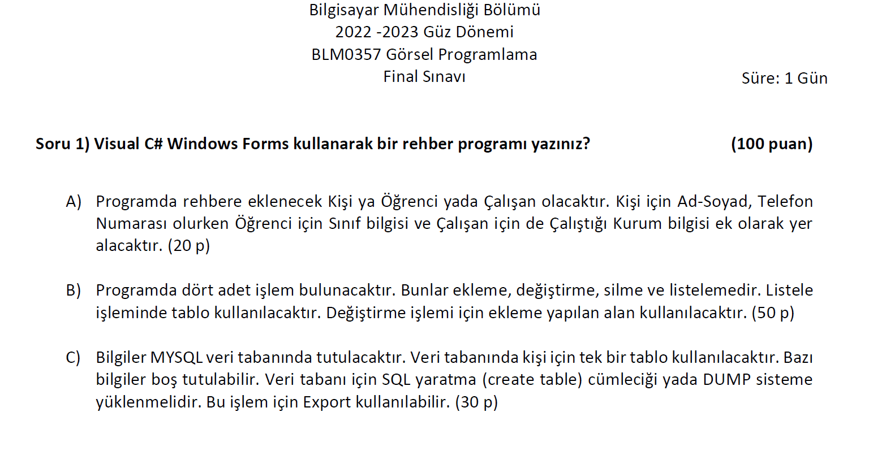
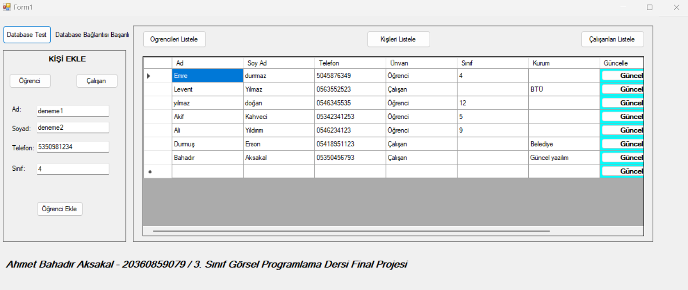
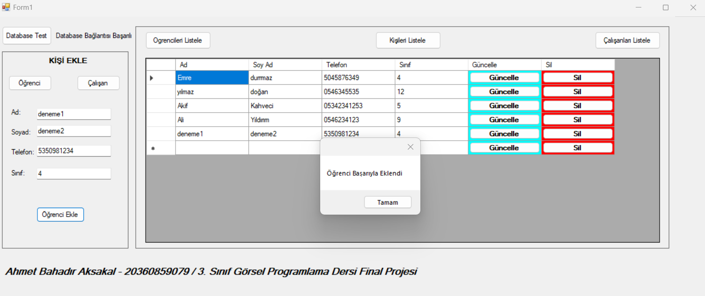
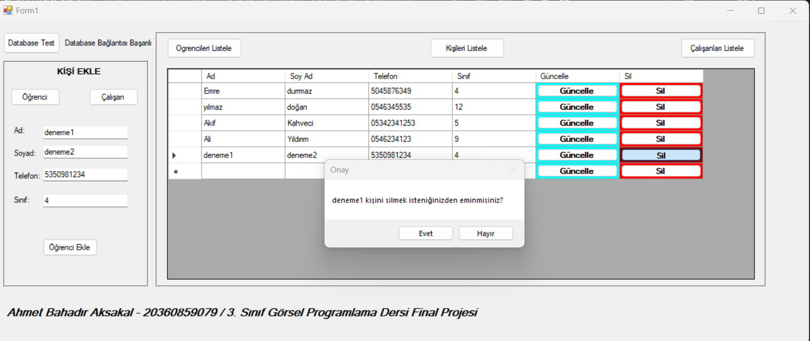
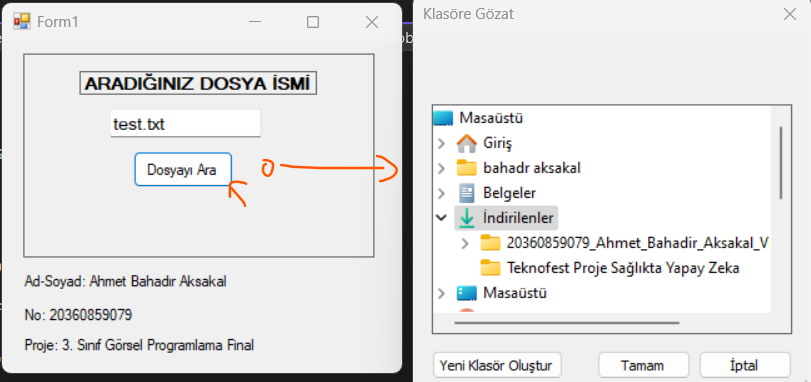
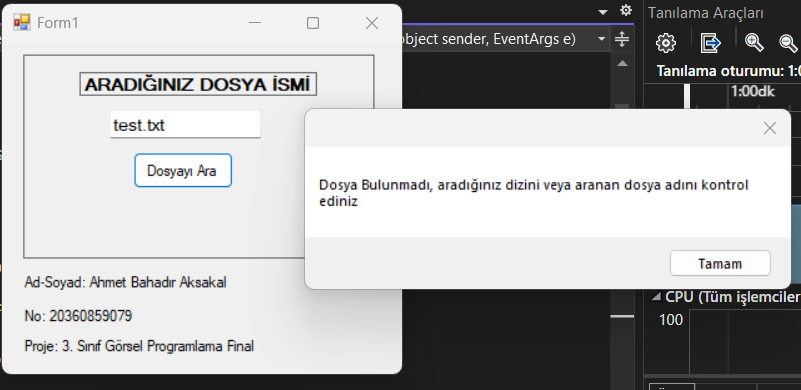
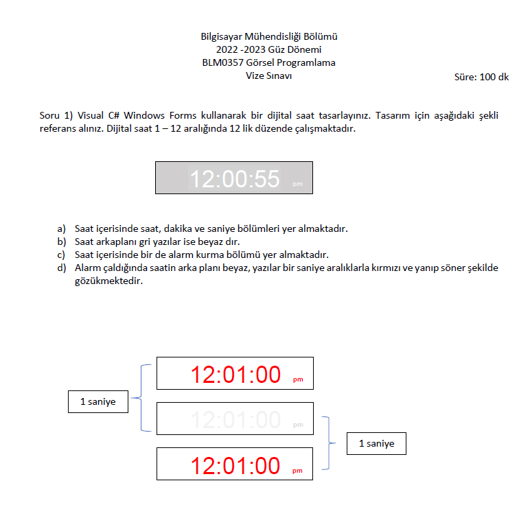
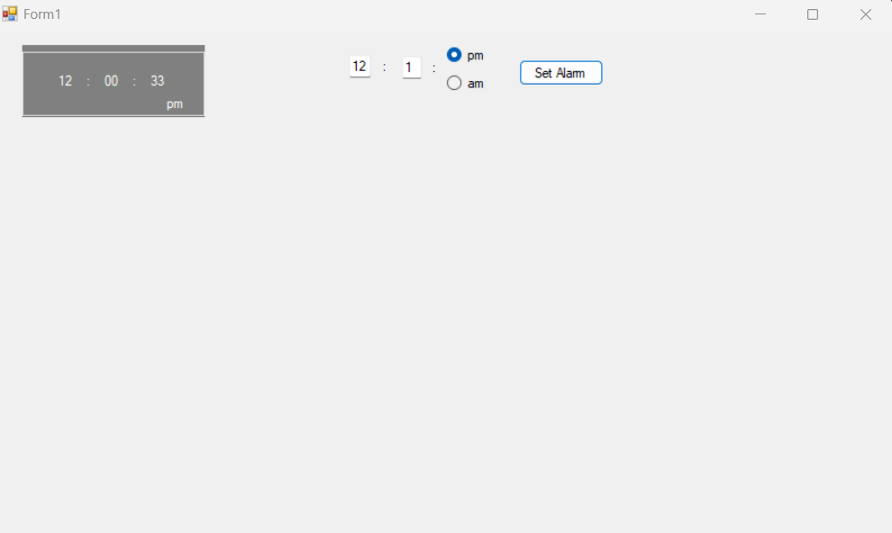
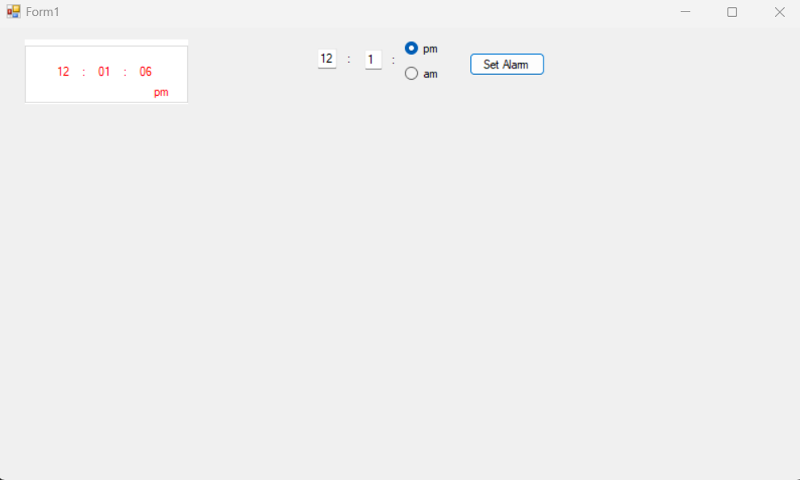

# .NET-Programlama-Dersi-Vize-Final-Sorulari-Cozumleri

<h3 align="center" color="Darkblue">Ahmet Bahadır Aksakal</h3>
<h4 align="center" color="Darkblue">20360859079</h4>

<ul>
<ol>
   <li><h2>Final Soru 1:</h2></li>
   <li>
       <h3 color="Red">Projede Kullanılan Teknoloji Ve Diller:</h3>
       <ul>
         <li>C#</li>
         <li>.Net</li>
         <li>Visual Studio</li>
       </ul>
   </li>
   <li>
       <h3 color="Red">Yapılması İstenilen Çözüm:</h3>
       <ul>
         <li></li>
       </ul>
   </li>
   <li>
       <h3 color="Red">Kurulum ve Çalıştırma:</h3>
       <ul>
          <li>mysql veritabanınızda, "database_ahmetbahadiraksakal_gorselprogramlamafinal.sql" dosyası içerisindeki sql kodunu çalıştırın, veritabanınızın oluştuğundan emin olun.</li>
          <li>.sln uzantılı dosyayı açın (Visual Studio kullanmanız önerilir) ve çalıştırın. Uygulanamanız hazır.</li>
       </ul>
   </li>
    <li>
       <h3 color="Red">Programdan Görseller:</h3>
       <ul>
         <li></li>
         <li></li>
         <li></li>
       </ul>
   </li>
 </ol>

 <ol>
   <h2>Final Soru 2:</h2>
   <li>
       <h3 color="Red">Projede Kullanılan Teknoloji Ve Diller:</h3>
       <ul>
         <li>C#</li>
         <li>.Net</li>
         <li>Visual Studio</li>
       </ul>
   </li>
   <li>
       <h3 color="Red">Yapılması İstenilen Çözüm:</h3>
       <ul>
         <li></li>
       </ul>
   </li>
   <li>
       <h3 color="Red">Kurulum ve Çalıştırma:</h3>
       <ul>
          <li>.sln uzantılı dosyayı açın (Visual Studio kullanmanız önerilir) ve çalıştırın. Uygulanamanız hazır.</li>
       </ul>
   </li>
    <li>
       <h3 color="Red">Programdan Görseller:</h3>
       <ul>
         <li></li>
         <li></li>
         <li></li>
       </ul>
   </li>
 </ol>

 <ol>
   <h2>Vize Soru 1:</h2>
   <li>
       <h3 color="Red">Projede Kullanılan Teknoloji Ve Diller:</h3>
       <ul>
         <li>C#</li>
         <li>.Net</li>
         <li>Visual Studio</li>
       </ul>
   </li>
   <li>
       <h3 color="Red">Yapılması İstenilen Çözüm:</h3>
       <ul>
         <li></li>
       </ul>
   </li>
   <li>
       <h3 color="Red">Kurulum ve Çalıştırma:</h3>
       <ul>
          <li>mysql veritabanınızda, "database_ahmetbahadiraksakal_gorselprogramlamafinal.sql" dosyası içerisindeki sql kodunu çalıştırın, veritabanınızın oluştuğundan emin olun.</li>
          <li>.sln uzantılı dosyayı açın (Visual Studio kullanmanız önerilir) ve çalıştırın. Uygulanamanız hazır.</li>
       </ul>
   </li>
    <li>
       <h3 color="Red">Programdan Görseller:</h3>
       <ul>
         <li></li>
         <li></li>
       </ul>
   </li>
 </ol>
 </ul>

